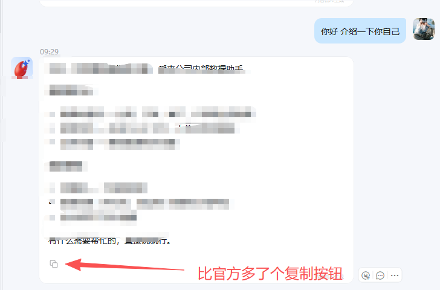

<div align="center">
  
  <h1>dingtalk-openclaw-connector（社区维护版）</h1>
  <p>基于官方 <strong>v0.8.20</strong> 的社区维护版本，由社区持续跟进修复官方无暇处理的 Bug。<br/>
  功能与官方完全一致，拥有最快的修复速度，及时合并官方pr和个人发现的bug和社区急需的 Bug。</p>

  <p>
    <a href="https://www.npmjs.com/package/@dingtalk-real-ai/dingtalk-connector"></a>
    <a href="https://www.npmjs.com/package/@dingtalk-real-ai/dingtalk-connector"></a>
    <a href="https://github.com/jeikl/dingtalk-openclaw-connector-fix-Community/blob/main/LICENSE"></a>
  </p>

  <p>
    <a href="README.en.md">🇺🇸 English</a> •
    <a href="CHANGELOG.md">更新日志</a> •
    <a href="https://openclaw.ai/">OpenClaw 官网</a>
  </p>
</div>

---

## 🔧 最近更新

| 日期 | 标识 | 更新内容 |
|------|------|---------|
| 2026-06-09 | 📁 | **专题 issue 统一至 `memory/*-issue.md`**：`dingtalk-issue` / `musa-stack-issue` / `openclaw-issue`；Agent 禁止堆叠根 MEMORY |
| 2026-06-09 | 🧠 | **memory-scope 架构优化（fix13–15）**：双层 MEMORY 注入、规则 sync、prompt 仅路径、移除 tool-guard；详见 [memory-scope](#-按用户群聊隔离长期记忆memory-scope) |
| 2026-06-08 | 🛡️ | **OpenClaw edit 参数校验 workaround（`edit-empty-oldtext`）**：dist patch 修复空 `oldText` 误报；见 `openclaw-patch/2026.5.7/edit-empty-oldtext/` |
| 2026-06-03 | 🔒 | **按用户/群聊隔离长期记忆（memory-scope）Phase 1**：钉钉多人共用一个 bot 时的 scope 目录与 session 解析；详见下方 [memory-scope](#-按用户群聊隔离长期记忆memory-scope) |
| 2026-05-14 | ✨ | Markdown 图片发送支持直链和本地路径，无需下载到本地，请参考下列提示词|
| 2026-05-11 | 🔧 | Agent 多轮循环完成后，中间过程消息重复发送到钉钉对话，造成刷屏和 AI Card 倒放重渲染 |
| 2026-05-11 | 🐛 | OpenClaw 4.29+ 版本导致钉钉插件失效，群聊 @Agent 回复显示"✅ 任务执行完成（无文本输出）" |
| 2026-05-08 | 🌐 | 未注册的 Pong 监听器导致的 WebSocket 幻影重连，来源于 [PR #566](https://github.com/DingTalk-Real-AI/dingtalk-openclaw-connector/pull/566)（[Majorshi](https://github.com/Majorshi) 提交） |

完整更新日志：[FIXES.md](FIXES.md)（[🇺🇸 English](FIXES.en.md)）

---

## ✨ 增强功能

- 🔧 Markdown 图片发送支持直链和本地路径，无需下载到本地：
  - Markdown 语法 `` 或 `` 直接发送图片
  - 兼容 mediaId 格式
  - ⚠️ 本插件支持图文发送，但钉钉侧不会主动触发此功能，需使用以下提示词引导 Agent：

    ```
    请你把以下发送图片的方式写成你的钉钉图片发送skill，当涉及到图片发送，则调用该技能：用markdown语法发送图片，支持添加图片注释实现图文并茂；直链图片或本地路径文件均可直接嵌入markdown发送，如本地路径含空格请先重命名去除空格再发送。
    ```

- 🎨 支持自定义 AI Card 模板，可使用本人预制的卡片（含内容复制按钮），不填则使用官方默认卡片。

**单机器人：**

```json
"channels": {
  "dingtalk-connector": {
    "enabled": true,
    "clientId": "你的clientId",
    "clientSecret": "你的clientSecret",
    "cardTemplateId": "你的卡片模板ID.schema",
    "cardContentVar": "content"
  }
}
```

**多机器人（多 Agent）：** 每个账号可绑定不同机器人

```json
"channels": {
  "dingtalk-connector": {
    "enabled": true,
    "accounts": {
      "main-bot": {
        "enabled": true,
        "name": "工作流机器人",
        "clientId": "你的clientId",
        "clientSecret": "你的clientSecret",
        "cardTemplateId": "f9b75aac-713c-40e8-a17f-e236d7b5422b.schema",
        "cardContentVar": "content"
      },
      "another-bot": {
        "enabled": true,
        "name": "另一个机器人",
        "clientId": "另一个clientId",
        "clientSecret": "另一个clientSecret",
        "cardTemplateId": "f9b75aac-713c-40e8-a17f-e236d7b5422b.schema",
        "cardContentVar": "content"
      }
    }
  }
}
```

| 参数 | 说明 |
|------|------|
| `clientId` / `clientSecret` | 单机器人模式直接填在顶层 |
| `accounts` | 多机器人模式，key 为账号标识名（可任意命名） |
| `accounts.*.enabled` | 是否启用该账号 |
| `accounts.*.name` | 账号显示名称（仅用于标识） |
| `accounts.*.clientId` | 钉钉应用 ClientId |
| `accounts.*.clientSecret` | 钉钉应用 ClientSecret |
| `cardTemplateId` | AI Card 模板 ID，不填则使用官方默认模板 |
| `cardContentVar` | 最终回复内容变量名，不填默认 `msgContent` |
| `cardProcessVar` | 中间过程（block 状态）变量名，不填默认使用 `cardContentVar` |
| `cardToolVar` | 工具调用输出变量名，不填则不写入卡片 |

> 卡片模板需在[钉钉开放平台](https://open.dingtalk.com/)创建，并添加对应的变量字段。

**效果预览：**



### 🔒 按用户/群聊隔离长期记忆（memory-scope）

多人共用一个钉钉机器人时，OpenClaw 默认会把 workspace 根目录 `MEMORY.md` 注入每一个 session，且用户专属规则容易写进公共层，导致跨用户泄漏或指令冲突。

社区版内置 **`memory-scope` 模块**（`src/memory-scope/`，与 message-handler / dws-oauth 解耦），在钉钉 session 上实现**双层记忆 + 规则 sync**（2026-06 优化）。

#### 双层记忆模型

| 层级 | 路径 | 内容 |
|------|------|------|
| **公共层** | `workspace/MEMORY.md` | 仅含 memory-scope 架构/纪律规则（标记段）；**Agent 不得堆叠内容** |
| **Scope 层** | `memory/users/{id}/MEMORY.md` 或 `memory/groups/{cid}/MEMORY.md` | 当前私聊/群聊专属偏好与规则 |
| **专题 issue** | `memory/dingtalk-issue.md` 等 | 钉钉 / MUSA / OpenClaw 踩坑（Agent 写入，见下方命名） |

OpenClaw bootstrap 以**完整文件路径**区分两份 `MEMORY.md`，不会混淆。

#### 工作机制

| 机制 | 作用 |
|------|------|
| `agent:bootstrap` | **同时**注入根 `MEMORY.md` 与当前 scope 的 `MEMORY.md`；scope 文件缺失时自动创建 |
| 插件 `register` 时 sync | 每次 gateway 启动 replace `MEMORY.md` / `AGENTS.md` 标记段（段外保留）；`AGENTS.md` 首次无标记时先 migrate 旧 OpenClaw 冲突段 |
| `before_prompt_build` | 仅注入 **Session memory paths**（3 行），不在 prompt 重复规则 |

**约束方式：** 本阶段**不使用** `before_tool_call` / tool-guard 做路径 block 或 rewrite，靠 bootstrap + `MEMORY.md` 规则 + 极简路径 prompt 约束模型行为。

#### 目录约定

| 场景 | 路径 |
|------|------|
| 私聊 | `memory/users/{senderId}/MEMORY.md`、`memory/users/{senderId}/YYYY-MM-DD.md` |
| 群聊 | `memory/groups/{conversationId}/MEMORY.md`、… |
| 群内按人隔离（`groupSessionScope: group_sender`） | `memory/groups/{conversationId}/users/{senderId}/...` |

#### 配置（默认开启）

```json
"channels": {
  "dingtalk-connector": {
    "memoryScope": {
      "enabled": true,
      "syncRootMemoryRules": true,
      "syncAgentsMemoryRules": true
    }
  }
}
```

| 选项 | 说明 |
|------|------|
| `enabled: false` | 关闭 memory-scope，恢复 OpenClaw 默认（全局 `MEMORY.md`） |
| `syncRootMemoryRules: false` | 不自动写入/更新 `MEMORY.md` 标记段，规则完全手动维护 |
| `syncAgentsMemoryRules: false` | 不自动 sync `AGENTS.md` memory 标记段 |

#### 规则维护

- 共享片段：`src/memory-scope/memory-rules-shared.ts`；模板：`root-memory-rules.ts`（纪律真源）、`agents-memory-rules.ts`（工作流 + 指向 MEMORY）
- `MEMORY.md` / `AGENTS.md` 标记段：**每次 gateway 启动** replace 标记段内内容（段外用户内容保留）；`AGENTS.md` 首次无标记时先 migrate 旧 OpenClaw 冲突段
- **Agent 禁止** write/edit 根 `MEMORY.md`；按主题写入 `memory/` 下专题 issue 文件：
  - 钉钉/dws/connector → `memory/dingtalk-issue.md`
  - MUSA 软件栈 → `memory/musa-stack-issue.md`
  - OpenClaw/gateway/插件 → `memory/openclaw-issue.md`
  - 用户偏好/「记住这个」→ 当前 scope

#### memory_search（Phase 1）

- `memory_search` / `memory_get` 仍索引整个 workspace，**不做** corpus 硬拦截
- 跨 scope 检索纪律写在 `MEMORY.md` 标记段，由模型遵守

#### Gateway 启动日志确认

```
[dingtalk-connector][memory-scope] synced root MEMORY.md rules section
[dingtalk-connector][memory-scope] synced AGENTS.md memory marked sections
[dingtalk-connector][memory-scope] registered (enabled=true, syncRootMemoryRules=true, syncAgentsMemoryRules=true)
```

实现细节与 Agent 话术见 bundled skill：`skills/dingtalk-channel-rules/SKILL.md`。

---

## 为什么 Fork？

由于钉钉官方连接器那拉稀的仓库更新与 Bug 修复速度，所以 fork 了此仓库。

本版本在官方代码基础上由社区进行 Bug 修复和维护。**BUG 采用 Claude Code 官方模型修复，保证最大修复效果。**

欢迎民间大神提 PR，共建钉钉连接器生态！

---

## 与官方版本的差异

| 项目 | 说明 |
|------|------|
| 基础版本 | 官方 v0.8.20，功能完全一致 |
| 修复内容 | 官方一直不修的 Bug（见上方最近修复） |
| 社区增强 | memory-scope 双层记忆 + `MEMORY.md` 规则 sync（`memoryScope`）、OpenClaw dist patch（`openclaw-patch/`）、社区 dws OAuth 补链等 |
| 维护方式 | 社区维护，持续跟进官方更新 |

---

## 安装与要求

开始之前，请确保：

- **OpenClaw**：已安装并正常运行。详情请访问 [OpenClaw 官网](https://openclaw.ai/)
- **版本要求**：OpenClaw ≥ **2026.4.9**，通过 `openclaw -v` 查看
- **dws CLI 与 dws skill**（钉钉业务能力必装）：connector **不再内置** `dws-cli` skill；**社区版配套** [WangKangAandy/dingtalk-workspace-cli](https://github.com/WangKangAandy/dingtalk-workspace-cli)（含 per-sender OAuth）。在 connector 目录执行 `npm install` 时会 **自动 clone/更新 dws fork、安装 skill 到 `~/.openclaw/skills/dws`、编译 CLI 到 `~/.local/bin/dws`**（需 git；编译 CLI 需 Go）

> 如低于此版本，执行 `npm install -g openclaw` 升级。

### dws 自动安装（推荐）

```bash
# 安装 connector 后在其目录执行（openclaw plugins install -l 也会触发 postinstall）
cd ~/.openclaw/extensions/dingtalk-connector   # 或你的 clone 路径
npm install
dws --version   # 确认 CLI 在 PATH（~/.local/bin）
```

环境变量（可选）：

| 变量 | 说明 |
|------|------|
| `DWS_SKIP_AUTO_INSTALL=1` | 跳过自动安装 |
| `DWS_COMMUNITY_REF=main` | 指定 git 分支/tag（默认 `main`） |

### 手动安装（网络受限或跳过 postinstall 时）

```bash
git clone https://github.com/WangKangAandy/dingtalk-workspace-cli.git ~/.openclaw/vendor/dingtalk-workspace-cli
cd ~/.openclaw/vendor/dingtalk-workspace-cli
go build -o ~/.local/bin/dws ./cmd
node /path/to/dingtalk-connector/scripts/install-community-dws.js
```

**勿用** `npm i -g dingtalk-workspace-cli`（官方 open-dingtalk 包，与社区 connector 不匹配）。

---

## 卸载官方插件（避免冲突）

安装本版本前，先移除官方已安装的插件：

```bash


# 卸载官方版本
openclaw plugins uninstall dingtalk-connector

```

---

## 手动构建与部署、或者直接下载release构建产物直接进行安装

本版本需要手动编译安装（社区修复版，不在 npm 发布）：

```bash
# 1. 克隆仓库
git clone https://ghfast.top/https://github.com/jeikl/dingtalk-openclaw-connector-fix-Community.git
cd dingtalk-openclaw-connector-fix-Community

# 2. 安装依赖 & 构建 & 打包

# npm
npm install
npm run build
npm pack

# 或者 pnpm
pnpm install
pnpm run build
pnpm pack

# 3. 安装到 OpenClaw 并重启（release或当前目录构建产物）
openclaw plugins install ./dingtalk-real-ai-dingtalk-connector-0.8.20-fix6.tgz
openclaw gateway restart
```

---

## 使用指南

[OpenClaw 钉钉官方插件使用指南](https://alidocs.dingtalk.com/i/nodes/2Amq4vjg89GEno0zfPqoPGqdV3kdP0wQ?utm_scene=team_space)

---

## 进阶文档

- [手动配置指南](docs/DINGTALK_MANUAL_SETUP.md) — 手动填写凭证配置
- [钉钉 DEAP Agent 集成](docs/DEAP_AGENT_GUIDE.md) — 本地设备操作能力
- [多 Agent 路由配置](docs/MULTI_AGENT_SETUP.md) — 多机器人绑定不同 Agent
- [常见问题](docs/TROUBLESHOOTING.md) — 安装与使用问题排查
- [官方 README（中文）](README_DINGTALK_OFFICIAL.md)
- [Official README（English）](README_DINGTALK_OFFICIAL_en.md)

---

## 贡献

欢迎社区贡献！Bug 修复或功能建议，请提交 [Issue](https://github.com/jeikl/dingtalk-openclaw-connector-fix-Community/issues) 或 Pull Request。

---

## 许可证

本项目基于 [MIT](LICENSE) 许可证。

---

## 支持

- **问题反馈**：[GitHub Issues](https://github.com/jeikl/dingtalk-openclaw-connector-fix-Community/issues)
- **更新日志**：[CHANGELOG.md](CHANGELOG.md)
