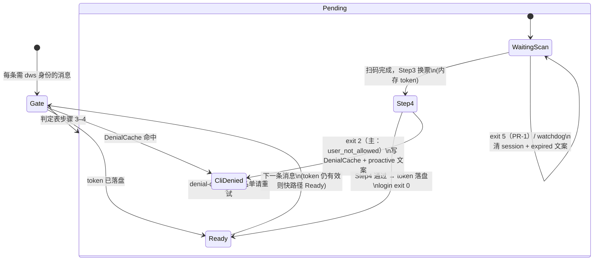

# DWS 认证流程优化 Plan（精简版）

> **版本：** v1.6  
> **日期：** 2026-06-11  
> **范围：** dingtalk-openclaw-connector + dws fork + Agent Skill  
> **背景：** 杨小羊（`605724761`）、Seal（`642225641`）— 重复推授权码、OAuth 页「授权成功」但 token 未落盘（CLI 名单拒绝）、未登录时 Agent 私自执行业务 `dws` 命令

---

## 1. 要解决的问题

| 现象 | 根因 |
|------|------|
| 连续收到多个 device code（KWZT → PTSP） | `user_not_allowed` 后仍自动 re-login |
| 用户见「授权成功」，机器人仍说未登录 | OAuth Step 2 成功 ≠ dws 落盘；Step 4 CLI 校验失败 |
| 机器人先说「我试了两次 doc search 失败」 | 未登录时仍执行业务 `dws`，结果确定性失败 |
| Agent 让用户手动 `dws auth login` | 绕过 connector 唯一入口 |
| 推了授权链接，用户长时间未扫码 | login 子进程超时退出；旧码失效；用户再发消息时状态不清晰 |

**平台约束（不可改）：** CLI 名单只能在用户 OAuth **之后**由 `/cli/cliAuthEnabled` 判断；第一次扫码无法提前知道是否在名单。

---

## 2. 标准化 Auth 流程（唯一目标）

一条链路，**以 token 是否落盘为唯一 Ready 标准**，不做并行编排系统。

> **Phase 1 目标态**（非 as-is）：现状仍以 `onCommandOutput` → `handleDwsAuthCommandOutput` 事后推链为主，见 §7。

### 2.0 关键节点：token 落盘

| 阶段 | token 状态 | `auth status` | 含义 |
|------|-----------|---------------|------|
| 未扫码 / 超时 | 无 | `false` | 正常 pending 或 expired |
| OAuth 页「授权成功」 | 内存有 access token，**未落盘** | `false` | 用户侧完成扫码；dws 内部尚未 Step 4 |
| dws Step 4 `user_not_allowed` | **不落盘** | `false` | **此时推 CLI 无权限文案** |
| dws Step 4 通过 | **落盘** | `true` | Ready，可执行业务 |

> **步骤编号：** 表中「OAuth 页」为用户感知；图中 **Step3/Step4** 为 `device_flow.go` 内部步骤（换票 → `/cli/cliAuthEnabled` → 落盘）。

**易混点（Seal / 杨小羊 case）：**

- CLI 无权限文案 **不是**「login 成功、token 落盘后，业务 `dws` 报无权限」。
- 实际是 device login **Step 3 换票成功**（内存有 token）→ **Step 4** `/cli/cliAuthEnabled` 判定 `user_not_allowed` → **拒绝落盘** → login exit 2。
- 未落盘时执行业务 `dws` 只会得到 `IDENTITY_NOT_AUTHENTICATED`，**不能**据此推断 CLI 名单状态。

DenialCache 记录的是「此人曾在 Step 4 被拒、token 从未落盘」，Gate 命中后**不再发 device code**，直接推 blocked 文案。



**Gate 判定顺序（每条用户消息，`ensureDwsAuth` 实现此表）：**

| 顺序 | 条件 | 结果 | 动作 |
|------|------|------|------|
| 1 | `auth status` = 落盘 | **Ready** | 进 Agent；token 过期后 status=false，**不会**误进 CliDenied |
| 2 | DenialCache 命中 | **CliDenied** | 同步推 blocked 文案，不发 device code，不进 Agent |
| 3b | `IDENTITY_MISMATCH` 冷却中（2min） | **Pending 等待** | 不 spawn、不复用链接；**优先于步骤 3**（与 `dws-oauth.ts` 一致） |
| 3 | `loginSessions` in-flight（`LOGIN_REUSE_MS` 5min 内） | **Pending 复用** | 重发同一链接或等待 URL；**禁止**新 spawn |
| 4 | 以上皆否 | **Pending 新建** | spawn login，推链，不进 Agent |

> **实现顺序：** 代码须 **先 3b 后 3**。MISMATCH 后 login 会 `clearLoginSession`，通常不与 in-flight 并存。

**图例：**

- `Gate → CliDenied` / `Gate → Pending`：**本轮消息**同步响应；`Step4 → CliDenied`：**login 子进程异步** proactive。
- `CliDenied` = DenialCache **持久标记**；其它 exit 2（如 `cli_not_enabled`）同样写 Cache（`denialReason` 区分），定制 blocked 文案仅 `user_not_allowed`，其余沿用 dws stderr（§6、§3.2）。
- `Ready → Gate`：多轮对话每消息从 Gate 重入；若 token 过期（status=false）且无 Cache → Gate 步骤 3/4（**非** CliDenied）。
- `IDENTITY_MISMATCH`：login exit 时清 session + 2min 冷却 + proactive；**不画 WaitingScan 自环**；下条消息走 Gate 步骤 3b。
- `WaitingScan` 自环：仅表超时（exit 5 / watchdog）；清 session + expired；用户下条消息走 Gate 步骤 4。
- in-flight 逻辑迁移自现有 `ensureDwsLoginAndNotify`（`LOGIN_REUSE_MS` / 等待 URL / 禁止双 spawn）。

**竞态（杨小羊「已授权好了」）：**

```text
T0  Gate 步骤 4 → spawn login，推链
T1  用户扫码，Step4 进行中，status 仍 false
T2  用户再发「已授权好了」→ Gate 步骤 3（in-flight）→ 复用/等待，禁止 spawn，不进 Agent
T3  login exit 0 → 下条消息 Gate 步骤 1 → Ready
```

### 2.1 标准步骤（每次用户消息）

```
1. Pre-flight Gate（connector `ensureDwsAuth`，见 §2.3、Gate 判定表）
   ├─ 1) auth status 落盘？ → ready，进 Agent
   ├─ 2) DenialCache？ → cliDenied，推文案，不进 Agent
   ├─ 3b) mismatch 冷却？ → 等待，不 spawn（优先）
   ├─ 3) in-flight login（5min）？ → 复用/等待，不 spawn，不进 Agent
   └─ 4) 否则 → spawn login，推链，不进 Agent

2. login 子进程（connector spawn，Agent 不得 exec/kill）
   ├─ Step3 换票 → Step4 /cli/cliAuthEnabled
   ├─ Step4 通过 → token 落盘 → exit 0 → ready，可选推送「授权成功，正在处理…」
   ├─ Step4 exit 2 → token 不落盘 → 写 DenialCache（denialReason）+ proactive 文案
   ├─ IDENTITY_MISMATCH → 2min 冷却，不写 DenialCache
   ├─ login 超时 → exit 5（PR-1）或 watchdog 10min → 清 session + expired 文案，不写 DenialCache
   └─ 其他 → 按 exit code 提示重试或联系运维

3. 业务执行（仅 token 已落盘 / ready）
   └─ Agent 执行业务 dws 命令；完成后下条消息从 Gate 步骤 1 重入
```

### 2.2 职责（三层，不新增多余抽象）

| 层 | 做什么 | 不做什么 |
|----|--------|----------|
| **dws** | device login、Step 4 校验、token 落盘；**规范 login exit code**（见 §3.1） | 钉钉发消息、DenialCache |
| **connector** | Pre-flight Gate、`ensureDwsAuth`、`denial-clear`、DenialCache 读写、推链/推拒绝文案 | 重写 OAuth |
| **Agent / Skill** | `ready` 后执行业务命令 | `auth login`、kill login 进程、未登录时业务 `dws` |

### 2.3 Pre-flight Gate（P0，硬门禁）

**原则：** 未 `authenticated` 时，**禁止**执行业务 `dws`（含 `--verbose` 重试）；login **仅** connector spawn，Agent 不得并行发起。

**现状问题：** 当前仅靠 `reply-dispatcher` → `onCommandOutput` → `handleDwsAuthCommandOutput`（Agent **先跑失败**才推链），无法避免 Seal 式试错。Phase 1 改为主路径 + 兜底。

| 层级 | 角色 | 说明 |
|------|------|------|
| **B（主路径）** | `message-handler` 入队前 `ensureDwsAuth` | `ready` → 进 Agent；`pending` / `cliDenied` → 推文案，**不进 Agent 工具阶段** |
| **A（兜底）** | `before_tool_call` hook | token 未落盘时拦截业务 `dws`；拦截 `dws auth login`；拦截对 login 子进程的 `kill` / `pkill` |

**ready 快路径：** Gate 步骤 1 仅 `dws auth status` 判定 token 落盘，通过即放行，无额外 spawn。

**in-flight 复用：** `ensureDwsAuth` 须迁入 `ensureDwsLoginAndNotify` 既有逻辑（`LOGIN_REUSE_MS`、等待 URL、进行中不双 spawn），见 Gate 判定表步骤 3。

用户说「已授权好了」时：走 Gate 步骤 3（in-flight 复用/等待），**禁止**新 spawn 与进 Agent；须等 login exit 0 或 status 落盘后，**下条消息** Gate 步骤 1 进 Ready。login 已超时则 Gate 步骤 4 重新推链。

**产品预期（Phase 1 刻意不做自动续跑）：** B 主路径下，扫码当轮消息**不进 Agent**；login exit 0 后**不会**自动执行用户原意图（如 doc search），用户须**再发一条消息**（pending 文案已引导）。可选 proactive「授权成功」仅作提示，不触发 Agent。

---

## 3. Phase 1 实施清单（仅此阶段为必做）

### 3.1 dws（最小改动）

| 项 | 说明 |
|----|------|
| login **exit code 规范** | 见下表；stderr 保留现有中文提示 |

**login exit code 映射（PR-1 验收必核对）：**

| exit | 含义 | 现状 | Phase 1 目标 |
|------|------|------|-------------|
| `0` | token 落盘成功 | 已有 | 保持 |
| `2` | Step4 / auth 类拒绝（`user_not_allowed`、`cli_not_enabled` 等） | 已有（`CategoryAuth`） | 保持；connector 据此写 DenialCache |
| `4` | **PAT 权限不足** | 已占用，**login 不得复用** | 保持 |
| `5` | device login **超时** / 授权码过期 | 暂无（超时现多为 exit 2 或 kill 信号） | **新增** `LoginTimeoutError` 或等价 ExitCoder |
| 其它 | 内部错误等 | exit 1/5/6 等 | 沿用 dws 既有分类 |

**不做（暂缓）：** `auth check-cli` 独立子命令、login `--format json` 全 phase 事件流、`auth session` detached、`dws auth denial-clear`（DenialCache 归 connector，见 §3.4）。

### 3.2 connector（扩展现有 `dws-oauth.ts`）

| 项 | 说明 |
|----|------|
| `ensureDwsAuth` | **主入口**（`message-handler` 入队前）：按 Gate 判定表 1→4；迁入 `ensureDwsLoginAndNotify` 的 in-flight / mismatch 复用逻辑 |
| `denial-clear` | 清 `~/.openclaw/connector/denial/<senderId>.json`（兼清旧路径）；响应用户「已加名单请重试」或运维操作 |
| 监听 login **exit** | exit 2 → DenialCache（带 `denialReason`）+ 文案；exit 0 → 可选成功通知；**exit 5 或 watchdog** → 清 session + expired 文案（§3.5） |
| exit 2 **文案分支**（PR-2 必做） | `denialReason === 'user_not_allowed'` → §3.6 blocked 模板；**其它**（如 `cli_not_enabled`）→ proactive 转发 dws stderr 摘要，**禁止**套用「加个人 CLI 名单」模板 |
| `before_tool_call` 兜底 | 拦业务 `dws`、拦 `dws auth login`、拦 kill login 进程（§2.3 A） |
| 复用现有能力 | 10min watchdog、5min 内复用同一 verificationUrl |

**与 `handleDwsAuthCommandOutput` 的关系（避免双 spawn）：**

```
ensureDwsAuth          ← 主路径：入队前判定 + 唯一 spawn login 入口
handleDwsAuthCommandOutput  ← 收缩为兜底：
  · token 落盘后的运行时失效（如 token_expired）
  · Gate 未覆盖的漏网 exec（before_tool_call 漏拦）
  · 不再作为「未登录 → ensureDwsLoginAndNotify」的默认触发器
```

现有 `reply-dispatcher` `onCommandOutput` 钩子保留，但 **未登录推链逻辑迁移至 `ensureDwsAuth`**；`parseDwsAuthError` 在 exit 2 / DenialCache 命中时 **禁止**再调用 `ensureDwsLoginAndNotify`。

**不做（暂缓）：** 独立 `AuthOrchestrator` 新模块名（逻辑并入 `dws-oauth.ts` 即可）、`OrgPolicyCache`。

### 3.3 Skill（文档约束）

**运行时文档：** `skills/dingtalk-troubleshoot/references/dws-auth-standard-flow.md`（状态图 + Gate 表）；`skills/dingtalk-troubleshoot/SKILL.md`（FAQ）；`skills/dingtalk-channel-rules/SKILL.md`（alwaysActive 短提醒）。

- 禁止 Agent `exec dws auth login`、`process kill` login 相关进程
- 禁止未 `authenticated` 时执行业务 `dws`
- `user_not_allowed`：引导联系管理员加 CLI 名单，提示「已加名单请重试」可触发 connector `denial-clear` 后再 login

### 3.4 DenialCache 语义

**路径：** `~/.openclaw/connector/denial/<senderId>.json`（Phase 1.5 自 `~/.dws/cache/denial/` 搬迁；读时自动迁移）

```json
{
  "senderId": "642225641",
  "denialReason": "user_not_allowed",
  "message": "您不在该组织的 CLI 授权人员范围内",
  "recordedAt": "2026-06-11T13:35:00Z"
}
```

| 问题 | 说明 |
|------|------|
| **为什么要缓存？** | 防止 connector **自动**再次 spawn login、再发 device code（已知 Step 4 拒绝） |
| **TTL？** | 可选兜底（建议 7d），**不是**「冷却期内禁止用户登录」 |
| **谁清缓存？** | **connector** 内 `denial-clear`（非 dws 命令）；路径 `~/.openclaw/connector/denial/<senderId>.json` |
| **管理员加名单后？** | `denial-clear` 或用户说「已加名单请重试」→ **立即**清除缓存并重新 login |
| **缓存期内用户能重试吗？** | 能，但必须**主动**触发清除；不会自动反复推新授权码 |

### 3.5 授权超时（最小补充）

**现状：** `dws-oauth.ts` 已有 `LOGIN_MAX_MS = 10min` watchdog（`SIGTERM` kill，子进程 exit **不稳定**）；钉钉 device code 有效期约 **15min**（`LOGIN_REUSE_MS = 5min` 内复用同一链接）。**exit 4 已被 PAT 占用**，login 超时不应复用 4。

**原则：** 超时 ≠ CLI 拒绝，**不写 DenialCache**；用户下次发消息时 Gate 仍 `not_authenticated` 且无 in-flight login → **spawn 新 login、发新码**。

| 时机 | 行为 |
|------|------|
| **connector watchdog 10min**（主路径，不依赖子进程 exit） | `clearLoginSession`；proactive 推 expired 文案（每轮 login 最多 1 条） |
| dws login exit `5`（PR-1 落地后） | 同上，与 watchdog 去重（同轮只推 1 条） |
| 5min 内再发消息、旧 login 仍存活 | 复用同一链接（`LOGIN_REUSE_MS`） |
| 10min 后再发消息 | 自动 spawn 新 login |
| 「已授权」但 `auth status` 仍为 false | 按 pending 重新推链，不跑业务 |

实现：watchdog 回调补 `sendProactive`；`proc.on("exit")` 增加 exit `5` 分支；**不以 exit 4 判断超时**。

### 3.6 推送文案（三种）

**blocked（`user_not_allowed`）：**

```markdown
您的钉钉账号已完成验证，但组织 **未将您加入 CLI 授权人员名单**，无法继续操作。

- 账号：`<senderId>`
- 请联系管理员在「开发者设置」中加入 CLI 授权名单
- 添加完成后请回复「已加名单请重试」
```

**pending（login 链接）：**

```markdown
需要您本人完成钉钉授权后才能继续。

授权码：`<userCode>`（15 分钟内有效）

<verificationUrl>

请使用 **本人** 钉钉扫码。完成后直接发送您的原问题即可。
```

**expired（超时）：**

```markdown
上一次钉钉授权已超时（授权码约 15 分钟内有效）。

请重新发送您的需求以获取新的授权链接。
```

---

## 4. 验收标准

| # | 场景 | 预期 |
|---|------|------|
| V1 | 未登录用户请求 doc search | **0** 次业务 `dws` 尝试；只收到 pending 授权链接 |
| V2 | 用户扫码 + Step3 换票成功，Step4 `user_not_allowed`（token **未**落盘） | proactive 收到 blocked 文案；**自动**不再发第二条 device code |
| V3 | V2 后管理员加名单 + `denial-clear` 或用户「已加名单请重试」 | **立即**可重新 login 并成功 |
| V4 | 已有 token 用户 | 0 次扫码，直接业务 |
| V5 | Seal / 杨小羊 session 复现 | 不出现「我试了两次 doc search」类试错文案 |
| V6 | 推链后 10min 内未扫码 | 收到 expired 文案；再发消息 Gate 步骤 4 获**新** device code；无 DenialCache |
| V10 | T2「已授权好了」且 Step4 进行中 | Gate 步骤 3 复用/等待；**0** 次新 spawn；不进 Agent |
| V7 | Step4 `cli_not_enabled`（exit 2） | **不自动**连发第二条 device code；文案可沿用 dws stderr |
| V8 | `IDENTITY_MISMATCH` | **不自动**连发第二条 device code（保留/沿用 2min cooldown） |
| V9 | PR-1 后核对 exit code 表（§3.1） | login 超时为 exit `5`；exit `4` 仍为 PAT；Step4 拒绝为 exit `2` |

---

## 5. PR 拆分（Phase 1 only）

| PR | 仓库 | 内容 |
|----|------|------|
| PR-1 | dws | login exit code 规范（含 exit `5` 超时）；**不含** denial-clear |
| PR-2 | connector | `ensureDwsAuth` + DenialCache 读写 + `denial-clear` + login exit 监听 + 文案 |
| PR-3 | connector | Pre-flight Gate（B 主路径）+ `before_tool_call` 兜底 + 收缩 `handleDwsAuthCommandOutput` |
| PR-4 | connector + Skill | 文档与集成测试（扩展 `dws-oauth-flow.test.ts`）；验收 V1–V10 |

---

## 6. 暂缓项（明确不做，避免过度设计）

| 原方案 | 暂缓原因 |
|--------|----------|
| `dws auth org-policy` / OrgPolicyCache | 需部署者 token + 定期刷新；Phase 1 用 DenialCache + 文案已够 |
| `dws auth is-allowed` / 抓包 allowedUsers | 依赖未知 API 字段，投入不确定 |
| `dws auth session` detached | connector `spawn` 已脱离 Agent exec；重复建设 |
| login 全 phase `--format json` | exit code + stderr 解析即可 |
| `dws auth check-cli` 独立命令 | CLI 名单已在 login Step4 判定；token 落盘后业务报错属 API 权限，与 Phase 1 CLI 名单分流无关 |
| Phase 3 MCP `precheck` API | 平台需求，与「标准化流程」正交；单独立项 |
| Phase 4 监控大盘 / gantt / auth-meta.json | 运维增强，非认证链路必需 |
| 7 种 `denialReason` 细分文案 | Phase 1：exit 2 **一律**写 DenialCache（`denialReason` 区分），**不连发两码**；定制文案仅 `user_not_allowed`，其余沿用 dws stderr |

---

## 7. 附录

| 资源 | 路径 |
|------|------|
| 现有 login 实现 | `src/dws-oauth.ts`（facade）+ `src/dws-auth/*` |
| device flow Step 4 | `vendor/dingtalk-workspace-cli/internal/auth/device_flow.go` |
| 杨小羊 session | `~/.openclaw/agents/main/sessions/7f7794a4-e000-4edb-8248-3721acee7022.jsonl` |
| Seal session | `~/.openclaw/agents/main/sessions/b2ef4d55-ad58-4144-93eb-dff259e23a46.jsonl` |
| 现有 auth 兜底钩子 | `src/reply-dispatcher.ts` → `onCommandOutput` → `handleDwsAuthCommandOutput` |
| issue 手册 #3 | `~/.openclaw/workspace/memory/dingtalk-issue.md` |

### 修订记录

| 版本 | 日期 | 说明 |
|------|------|------|
| v1.0 | 2026-06-10 | 初版 |
| v1.1 | 2026-06-11 | 精简：只保留 Phase 1 标准化流程；补 Pre-flight Gate、DenialCache 语义；Seal case；暂缓过度设计项 |
| v1.2 | 2026-06-11 | 补授权超时：exit 4 / watchdog、超时文案、不写 DenialCache、用户再访自动新链 |
| v1.3 | 2026-06-11 | 以 token 落盘为核心节点；CliDenied 仅在 Step4 后推文案；去掉 Blocked→[*] 误导边 |
| v1.4 | 2026-06-11 | Gate 定 B 主/A 兜底；denial-clear 归 connector；exit 5 超时（4 保留 PAT）；ensureDwsAuth 与 handleDws 分工；补 V7–V9 |
| v1.5 | 2026-06-11 | Gate 判定表；Ready→Gate 多轮重入；in-flight/竞态/步骤编号图注；V10；标 Phase 1 目标态 |
| v1.6 | 2026-06-11 | Gate 3b 优先于 3；MISMATCH/过期图注；exit 2 文案分支；授权后须再发消息的产品预期 |
| — | 2026-06-11 | Phase 1 实现后：见 [DWS_AUTH_PHASE1_5_REFACTOR.md](./DWS_AUTH_PHASE1_5_REFACTOR.md)（契约 + 拆模块，不改行为） |
| — | 2026-06-11 | Phase 1.5 完成：拆 `dws-auth/*`、去 `gateReadySenders`、DenialCache 迁路径、`status-cache` 30s 共享缓存 |

---

**总结：** 目标不是建一套认证中台，而是 **一条标准链路** — 入队前 `ensureDwsAuth`（B）+ `before_tool_call` 兜底（A）→ 只看 **token 是否落盘** → login Step4 分流 → 仅落盘后执行业务；CLI 拒绝在 Step4 直说（token 不落盘），exit 2 写 DenialCache 不连发两码；超时走 watchdog / exit 5，不写 cache；`denial-clear` 在 connector 恢复。
