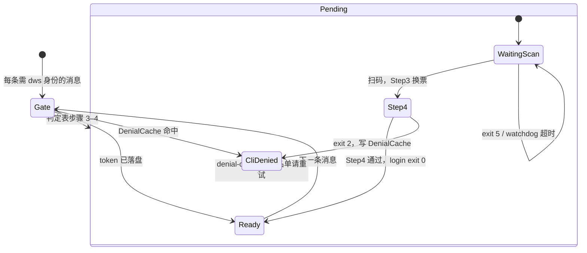

# DWS 标准化登录验证流程（Agent 参考）

> 工程完整版见 `docs/DWS_AUTH_OPTIMIZATION_PLAN.md`（v1.6）。本文供 Agent 理解 **为何不能手动 login / 不能未授权跑业务**。

## 唯一 Ready 标准

**token 已落盘**（`dws auth status` → `authenticated: true`）才可执行业务 `dws`。

| 阶段 | `auth status` | Agent 能否跑业务 |
|------|---------------|------------------|
| 未扫码 / 超时 | `false` | 否 |
| OAuth 页「授权成功」（Step4 未完成） | `false` | 否 |
| Step4 `user_not_allowed`（token 未落盘） | `false` | 否 |
| Step4 通过，token 落盘 | `true` | 是 |

## CLI 名单拒绝：确定性链路（非 Agent 猜测）

判定发生在 **login 子进程 Step4**，不是业务 `dws` 命令：

```text
用户扫码 → dws Step3 换票
         → dws Step4 调钉钉 /cli/cliAuthEnabled（后端 API）
         → classifyDenialReason 解析响应
         → 若 user_not_allowed：stderr 输出中文 + DWS_AUTH_DENIAL reason=...
         → login exit 2，token 不落盘
         → connector parseLoginDenial → DenialCache → proactive blocked 文案
         → 下条消息 Gate 命中 Cache，不进 Agent
```

**Phase 1 下 Agent 不应执行业务 `dws` 来「探测」是否在名单。** 若 Gate 漏拦（旧行为），业务只会返回 `IDENTITY_NOT_AUTHENTICATED`，**无法**反推 CLI 名单——这是旧链路缺陷，不是 Agent 诊断依据。

**token 落盘后**执行业务 `dws` 若失败，以**当次 API 返回的 stderr/log** 为准（多为 scope/业务权限），与 Step4 CLI 名单是不同阶段。

## 状态图（connector 编排）



## Gate 判定（每条用户消息，Agent 不实现，但须遵守结果）

| 顺序 | 条件 | 结果 | Agent 行为 |
|------|------|------|------------|
| 1 | token 落盘 | **Ready** | 可执行业务 `dws` |
| 2 | DenialCache 命中 | **CliDenied** | 不进 Agent；勿 spawn login |
| 3b | IDENTITY_MISMATCH 冷却（2min） | **Pending** | 等待 connector，勿重试业务 |
| 3 | login 进行中（5min 内） | **Pending** | 等待扫码；用户说「已授权好了」也勿手动 login |
| 4 | 以上皆否 | **Pending** | connector 推新授权链；勿手动 login |

**产品预期：** 扫码当轮消息不进 Agent；login 成功后用户须 **再发一条消息**，系统不会自动续跑原意图。

## Agent 职责（MUST / NEVER）

**MUST**

- token 落盘（Ready）后再执行业务 `dws`
- 未授权时告知用户等待 connector 推送的授权链接
- 用户已收到 connector blocked 文案时：复述说明，引导加名单或「已加名单请重试」；**不要**自行从症状推断 denialReason
- 将 HTTP 403 / scope 权限问题与登录问题区分处理

**NEVER**

- `dws auth login`（由 connector 唯一 spawn）
- `kill` / `pkill` login 相关进程
- 未 Ready 时用业务 `dws`「试一下」或 `--verbose` 探测
- 把 OAuth 页「授权成功」等同于可执行业务
- 从 `IDENTITY_NOT_AUTHENTICATED` 反推「不在 CLI 名单」或让用户再扫一次来「确认」

## login exit code 速查

| exit | 含义 | DenialCache | Agent |
|------|------|-------------|-------|
| 0 | Step4 通过，token 落盘 | 不写 | 请用户再发消息后继续 |
| 2 | Step4 拒绝（含 `user_not_allowed`） | 写入 | 勿再 login；按 blocked 文案引导 |
| 5 | login 超时 | 不写 | 请用户重新发消息获取新链 |
| 4 | PAT 相关 | — | 非 device login 流程 |

stderr 契约行（供 connector 解析）：`DWS_AUTH_DENIAL reason=user_not_allowed|cli_not_enabled|user_forbidden|auth_denied`

## 竞态：用户说「已授权好了」

```text
T0  connector spawn login，推链
T1  用户扫码，Step4 进行中，status 仍 false
T2  用户再发「已授权好了」→ in-flight 等待，禁止新 spawn
T3  login exit 0 → 下条消息 Ready
```

此时 Agent **不要**手动 login 或执行业务 `dws`。
