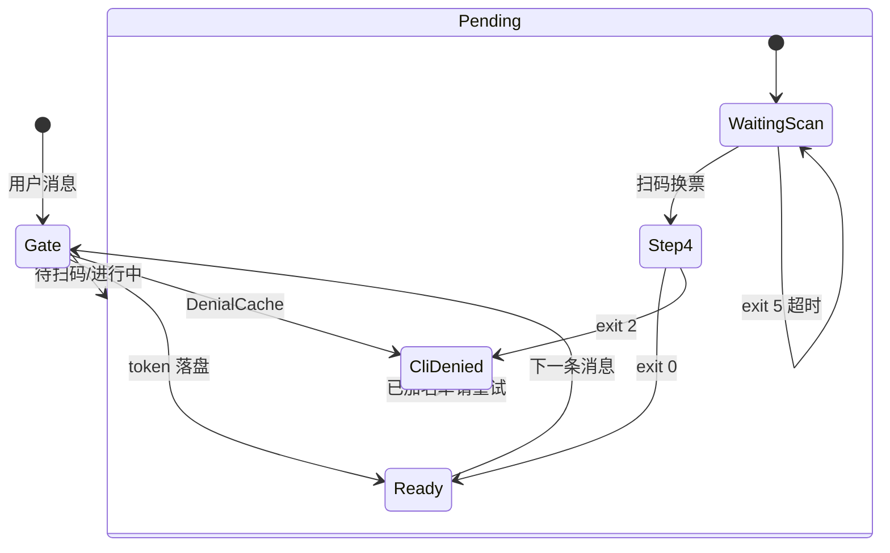

# DWS 登录验证流程

## 分工

| 角色 | 登录 | 业务 `dws` |
|------|------|------------|
| **connector** | 后台执行 `dws auth login --sender-id <id> --device`，proactive 推授权链 | — |
| **Agent** | **不得** `exec` 上述命令，不得 kill login 进程 | 仅 **Ready**（token 落盘）后执行 |

Ready = `dws auth status` → `authenticated: true`。

## 状态图

## Gate 结果（connector 判定，Agent 服从）

| 结果 | 含义 | Agent |
|------|------|-------|
| **Ready** | token 已落盘 | 可执行业务 `dws` |
| **CliDenied** | Step4 曾拒绝，DenialCache 命中 | 复述 connector 已推的 blocked 文案 |
| **Pending** | 待扫码 / login 进行中 / mismatch 冷却 | 告知等待授权；授权后请用户**再发一条消息** |

扫码当轮不进 Agent；login 成功也不会自动续跑原意图。

## CLI 名单拒绝（确定性，非 Agent 推断）

发生在 login **Step4**（`/cli/cliAuthEnabled`），不是业务 `dws`：

`扫码 → Step4 API → DWS_AUTH_DENIAL + exit 2 → DenialCache → blocked 文案 → Gate 拦截`

- `IDENTITY_NOT_AUTHENTICATED` 只表示 token 未落盘，**不能**反推是否在 CLI 名单
- token 落盘后业务失败：以**当次 stderr/API 响应**为准

运维日志：`grep '[DingTalk][dws-auth-gate]'`（`cliDenied` / `ready` + `denialReason`）

## login exit code

| exit | 含义 |
|------|------|
| 0 | token 落盘 |
| 2 | Step4 拒绝，写 DenialCache |
| 5 | 超时，不写 Cache |
| 4 | PAT（非 device login） |

契约行：`DWS_AUTH_DENIAL reason=<user_not_allowed|cli_not_enabled|user_forbidden|auth_denied>`

## 「已授权好了」竞态

Step4 进行中时 status 仍为 false → Gate 走 Pending 等待，不新 spawn。login exit 0 后，**下一条消息**才 Ready。
